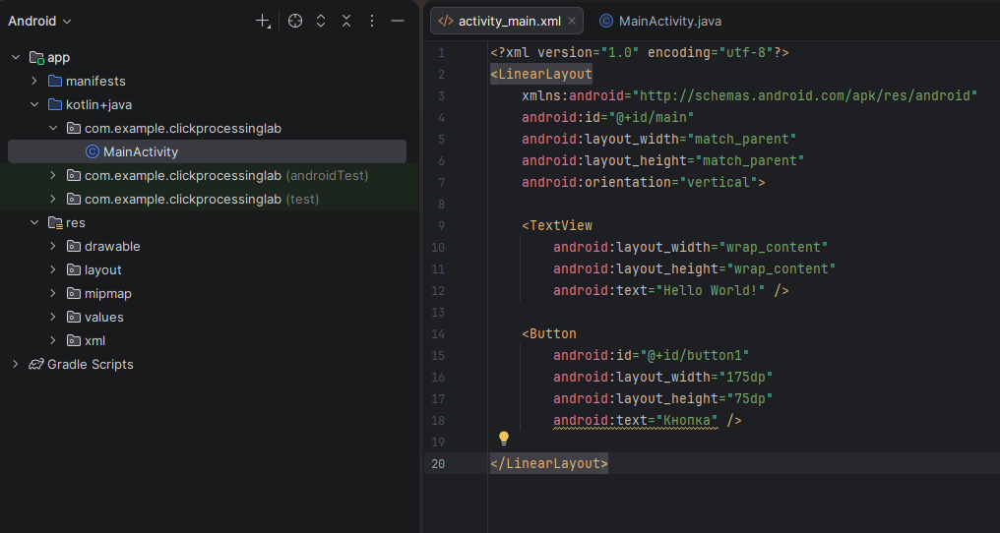
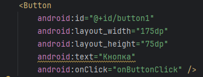
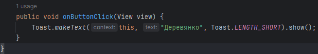
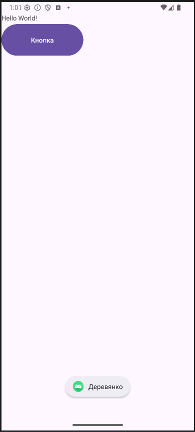
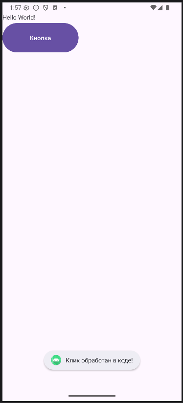
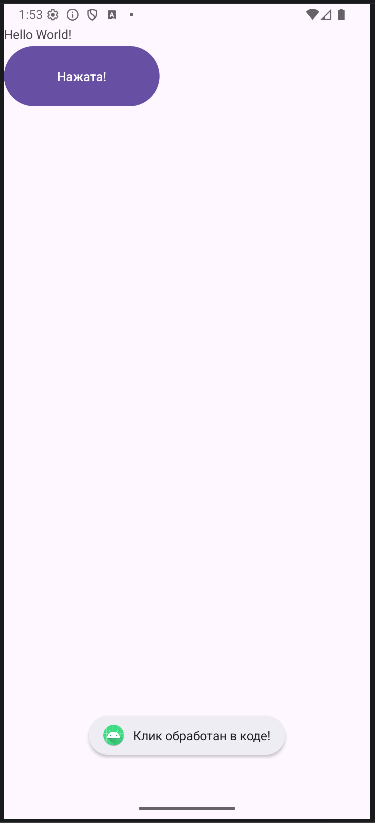
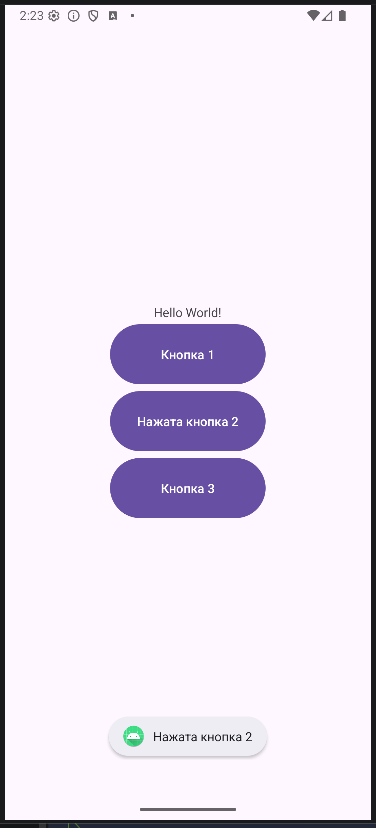

<div align="center">

# Отчёт

</div>

<div align="center">

## Практическая работа №3

</div>

<div align="center">

## Обработка событий клика

</div>

**Выполнил:** Федоров Артём Александрович<br>
**Курс:** 2<br>
**Группа:** ИНС-б-о-24-2<br>
**Направление:** 09.03.02 Информационные системы и технологии<br>
**Проверил:** Потапов Иван Романович

---

### Цель работы
Изучить механизм обработки событий в Android. Научиться обрабатывать нажатия на элементы интерфейса (кнопки) с помощью декларативного подхода (XML) и программного подхода (Java). Освоить работу с идентификаторами ресурсов и Toast-уведомлениями.

### Ход работы
#### Задание 1: Создание проекта и верстка экрана
  1. Было открыто Android Studio и создан новый проект с шаблоном **Empty Views Activity**. Проекту дано имя `ClickProcessingLab`.
  2. Открыт файл `activity_main.xml`. Существующий `TextView` был обёрнут в `LinearLayout` с вертикальной ориентацией (`orientation="vertical"`).
  3. Под стандартным `TextView` добавлена кнопака со следующими параметрами:
```xml
  android:id="@+id/button1"
  android:layout_width="175dp"
  android:layout_height="75dp"
  android:text="Кнопка"    
```
  

#### Задание 2: Обработка клика через XML-атрибут onClick (Декларативный подход)
  1. В файле `activity_main.xml` к кнопке добавлен атрибут `onClick`<br>
  
  2. В файле `MainActivity.java` создан метод с именем `onButtonClick`, который соответствуюет сигнатуре, требуемой для обработчика кликов. Добавлен показ всплывающего сообщения (Toast) внутрь метода.<br>
  
  3. Приложение запущено. При нажатии на кнопку появляется всплывающее сообщение.<br>
  

#### Задание 3: Обработка клика через setOnClickListener (Программный подход)
  1. Атрибут `android:onClick` был удалён из XML-разметки кнопки.
  2. В методе `OnCreate` файла `MainActivity.java` получена ссылка на кнопку по её идентификатору и установлен слушатель событий.
  ##### Обновлённый метод `onCreate`
  ```java
    @Override
    protected void onCreate(Bundle savedInstanceState) {
        super.onCreate(savedInstanceState);
        EdgeToEdge.enable(this);
        setContentView(R.layout.activity_main);

        ViewCompat.setOnApplyWindowInsetsListener(findViewById(R.id.main), (v, insets) -> {
            Insets systemBars = insets.getInsets(WindowInsetsCompat.Type.systemBars());
            v.setPadding(systemBars.left, systemBars.top, systemBars.right, systemBars.bottom);
            return insets;
        });

        Button myButton = findViewById(R.id.button1);
        myButton.setOnClickListener(new View.OnClickListener() {
            @Override
            public void onClick(View v) {
                Toast.makeText(MainActivity.this, "Клик обработан в коде!", Toast.LENGTH_SHORT).show();
            }
        });
    }
  ```
  

#### Задание 4: Использование аргумента View для изменения нажатой кнопки
  Модифицирован код из задания 3: внутри метода `onClick` изменён текст самой нажатой кнопки.
  ##### Модифицированный код
  ```java
    myButton.setOnClickListener(new View.OnClickListener() {
      @Override
      public void onClick(View v) {
        Button clickedButton = (Button) v;
        clickedButton.setText("Нажата!");
        // Или в одну строку: ((Button)v).setText("Нажата!");
        Toast.makeText(MainActivity.this, "Клик обработан в коде!", Toast.LENGTH_SHORT).show();
      }
    });
  ```
  

#### Задание 5: Работа с несколькими кнопками
  1. В `activity_main.xml` добавлены ещё две кнопки, которым присвоены уникальные id: `@+id/button2` и `@+id/button3`.
  ##### Кнопки в `activity_main.xml`
  ```xml
    <Button
        android:id="@+id/button1"
        android:layout_width="175dp"
        android:layout_height="75dp"
        android:text="Кнопка 1" />

    <Button
        android:id="@+id/button2"
        android:layout_width="175dp"
        android:layout_height="75dp"
        android:text="Кнопка 2" />

    <Button
        android:id="@+id/button3"
        android:layout_width="175dp"
        android:layout_height="75dp"
        android:text="Кнопка 3" />
  ```
  2. В методе `OnCreate` получены ссылки на все три кнопки и каждой назначен свой отдельный слушатель.
  ##### Обработчики кнопок в `MainActivity.java`
  ```java
    Button button1 = findViewById(R.id.button1);
    Button button2 = findViewById(R.id.button2);
    Button button3 = findViewById(R.id.button3);

    button1.setOnClickListener(new View.OnClickListener() {
    @Override
    public void onClick(View v) {
        //Button clickedButton = (Button) v;
        //clickedButton.setText("Нажата!");
        // Или в одну строку: ((Button)v).setText("Нажата!");
        ((Button)v).setText("Нажата кнопка 1");
        Toast.makeText(MainActivity.this, "Нажата кнопка 1", Toast.LENGTH_SHORT).show();
      }
    });

    button2.setOnClickListener(new View.OnClickListener() {
    @Override
    public void onClick(View v) {
        ((Button)v).setText("Нажата кнопка 2");
        Toast.makeText(MainActivity.this, "Нажата кнопка 2", Toast.LENGTH_SHORT).show();
      }
    });

    button3.setOnClickListener(new View.OnClickListener() {
    @Override
    public void onClick(View v) {
        ((Button)v).setText("Нажата кнопка 3");
        Toast.makeText(MainActivity.this, "Нажата кнопка 3", Toast.LENGTH_SHORT).show();
      }
    });
  ```
  3. Выравнивание `LienerLayout` было установлено по центру для наглядности.<br>
  

#### Задание для самостоятельного выполнения
  1. **Фамилия при клике.** Приложение из Задания 2 было модифицировано так, чтобы при нажатии на кнопку на экране отображался Toast с фамилией и инициалами.
  2. **Изменение текста кнопки.** Добавлена вторая кнопка. Сделано так, чтобы при нажатии на эту кнопку, текст на ней же менялся на фамилию.
  3. **Три кнопки и три события.** Создано три кнопки. Реализована логика где для каждой кнопки назначен отдельный слушатель. При нажатии на любую из кнопок, Toast выводит фамилию, но с указанием, какая именно кнопка была нажата.
  4. **Три кнопки и один слушатель.** Выполнено задание 3, используя один общий объект-слушатель и проверяя `v.getId()` для идентификации нажатой кнопки.
  5. **Переключение реакции.** Созадно новое приложение с двумя кнопками. Реализована логика, при которой нажатие на первую кнопку включает "режим А" (показывается Toast с фамилией), а нажатие на вторую кнопку переключает в "режим Б" (при нажатии на первую кнопку Toast показывает номер группы).

### Вывод
В результате выполнения практической работы был изучен механизм обработки событий в Android. Получены навыки по обработке нажатия на элементы интерфейса (кнопки) с помощью декларативного подхода (XML) и программного подхода (Java). Освоена работа с идентификаторами ресурсов и Toast-уведомлениями.

### Ответы на контрольные вопросы
1. **Что такое ViewBinding и в чем его преимущество перед findViewById()?**<br>
**ViewBinding** — это механизм генерации класса-привязки, который содержит прямые ссылки на все View с id из XML-разметки.

**Преимущества:**
- **Безопасность типов** — нет необходимости в приведении типов
- **Защита от NullPointerException** — все ссылки гарантированно инициализированы
- **Удобство** — автодополнение кода и проверка на этапе компиляции

**Подключение:**
В `build.gradle` (модуль app):
```gradle
android {
    buildFeatures {
        viewBinding true
    }
}
```
2. **В чем разница между декларативной (XML-атрибут onClick) и программной (setOnClickListener) подпиской на событие? Когда какой способ предпочтительнее?**<br>
Декларативный подход (android:onClick в XML) проще и быстрее для простых случаев, но менее гибкий — метод должен быть public в Activity. Программный подход (setOnClickListener в Java-коде) более гибкий, позволяет динамически менять обработчики, использовать анонимные классы и лямбда-выражения. Декларативный предпочтителен для простых UI, программный — для сложной логики, динамических интерфейсов и когда нужно менять поведение во время выполнения.
3. **Что произойдет, если в методе-обработчике, указанном в XML, изменить сигнатуру (например, убрать параметр View v)? Почему?**<br>
Приложение упадет с ошибкой IllegalStateException при запуске или при нажатии на кнопку, потому что система Android через рефлексию ищет метод с точной сигнатурой: `public void methodName(View v)`. Если сигнатура не совпадает (нет параметра View, другой тип возвращаемого значения или метод не public), система не сможет вызвать обработчик и выбросит исключение с сообщением о том, что метод не найден.
4. **Опишите жизненный цикл Activity. В каком методе (onCreate, onStart, onResume) лучше всего инициализировать слушатели для кнопок и почему?**<br>
Жизненный цикл Activity: onCreate() → onStart() → onResume() → (Activity активна) → onPause() → onStop() → onDestroy(). Инициализировать слушатели лучше всего в onCreate(), потому что этот метод вызывается один раз при создании Activity, когда интерфейс уже загружен (после setContentView), но Activity еще не видна пользователю. Это обеспечивает однократную инициализацию, лучшую производительность и избегает повторной настройки при каждом возврате к Activity (что произошло бы в onResume()).
5. **Что такое анонимный внутренний класс? Как он используется при установке слушателей событий в Java?**<br>
Анонимный внутренний класс — это класс без имени, который объявляется и создается в одном выражении, обычно для однократного использования. Он используется при установке слушателей событий для реализации интерфейсов (например, View.OnClickListener) без создания отдельного именованного класса. Это позволяет писать компактный код, логика которого находится непосредственно в месте использования, но может привести к дублированию кода при множественных обработчиках.
